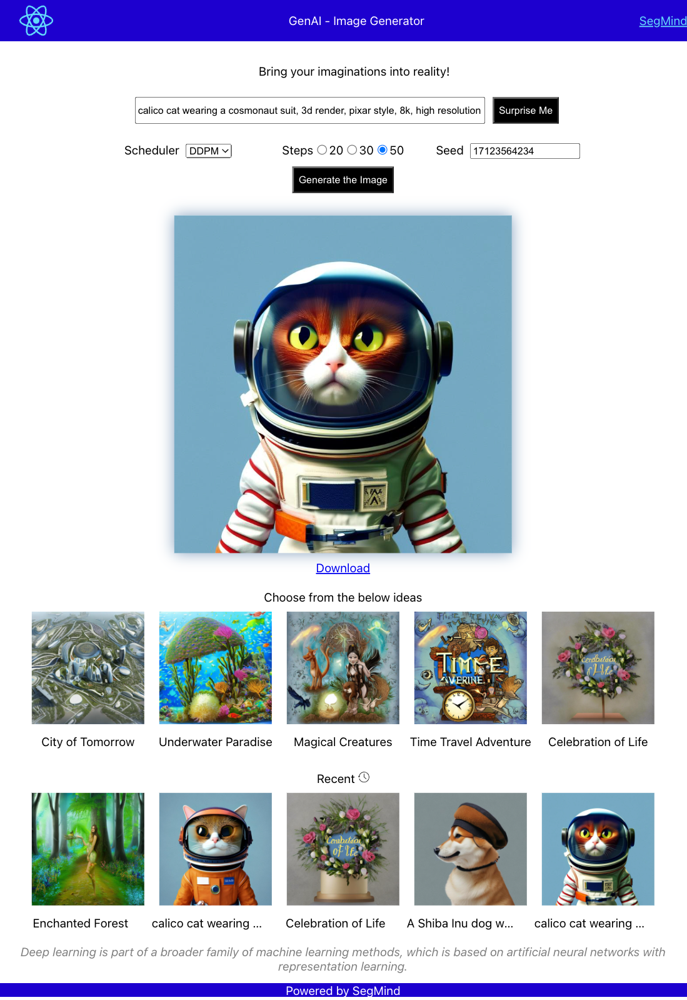

# Simple React App to demonstrate GenAI Text2Image APIs powered by SegMind

Features:
1) Generate the image from the prompt with various parameters.
2) Surprise Me option to get the idea instantly, if you're falling short ;).
3) Few previously generated images to pick from.
4) Recent history of the generated images, can be picked again.
5) Download the generated images.

Tools
1) Uses latest React hooks to fetch the SegMind text2Img API. (Create your own API from https://www.SegMind.com)
2) Deployed on Firebase.
3) Recent history has been stored on the localStorage.

Furthur Scope for devs:
1) Create an image slideshow with recent history of generated images.
2) Build create APIs to post images on your servers, and fetch from those APIs and show on the app.

## Available Scripts

In the project directory, you can run:

### `npm start`

Runs the app in the development mode.\
Open [http://localhost:3000](http://localhost:3000) to view it in your browser.

The page will reload when you make changes.\
You may also see any lint errors in the console.
